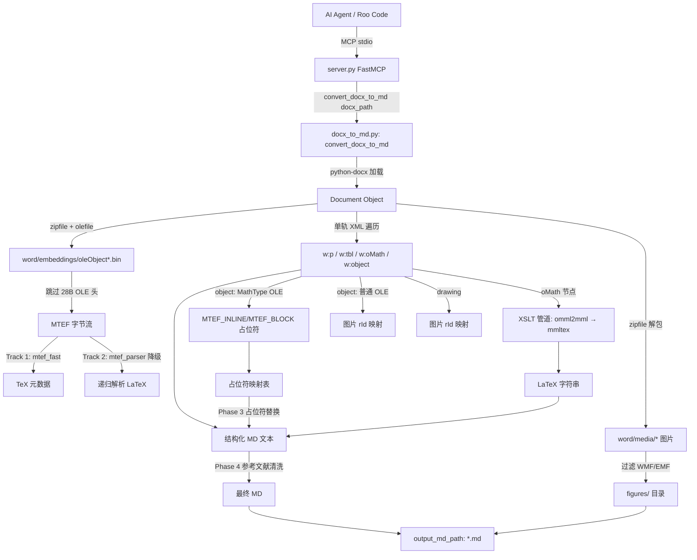
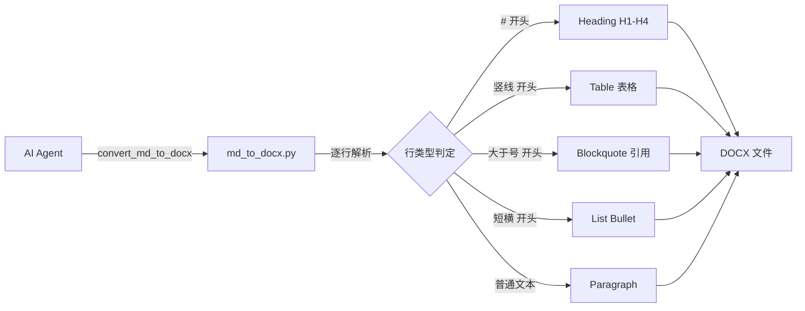
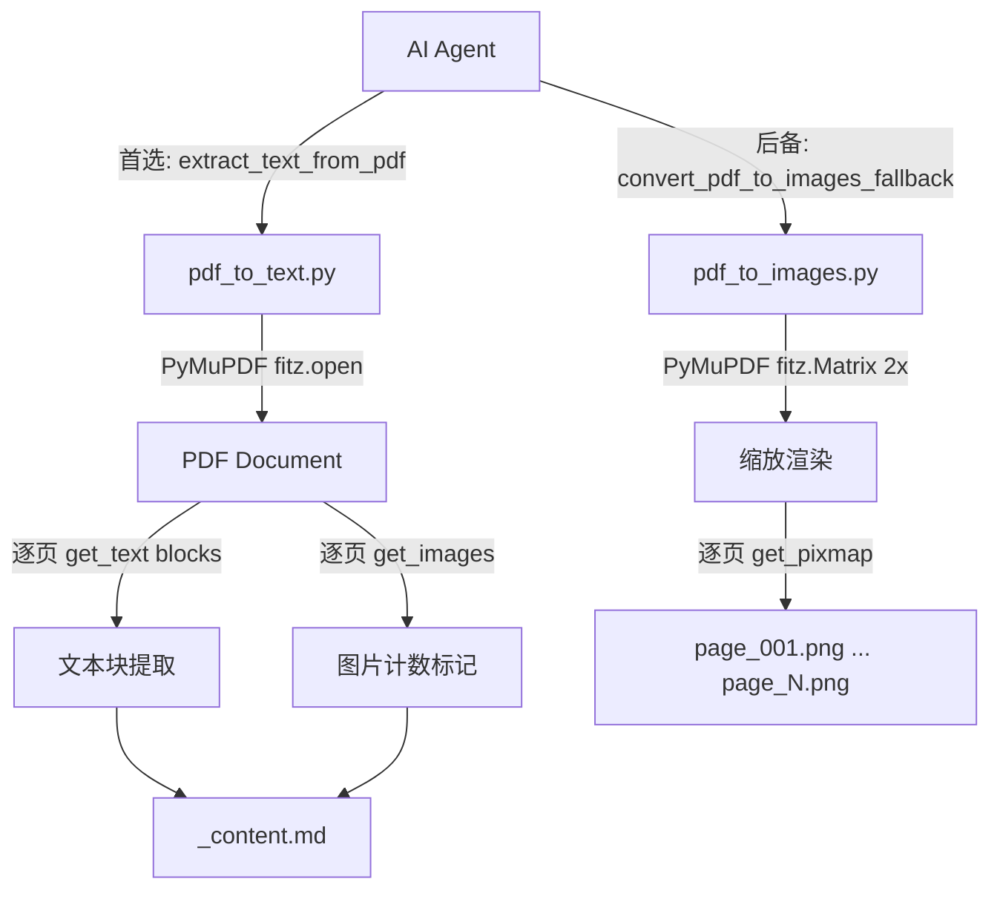

# 项目现状梳理 — Roo_Code_utils MCP Server

> **审计时间**: 2026-05-26 16:38 CST
> **审计版本**: v1.0 (初次审查)
> **项目根路径**: `D:/FJL/Projects/Kilo_Code_Gobal_Settings/Roo_Code_utils/`
> **Git 状态**: 已纳入版本管理

---

## 1. 运行前置清单

### 1.1 硬件基线约束

| 维度 | 要求 | 备注 |
|------|------|------|
| 处理器 | x86-64 (Windows) | 无 ARM 适配验证 |
| 内存 | >= 4GB (建议 8GB+) | 大文件 DOCX/PDF 解析需额外内存 |
| 磁盘 | >= 500MB 可用空间 | 含 Conda 环境 + 依赖项 |
| GPU | 不要求 | OCR 管线已于 2026-05-25 移除 |

### 1.2 环境依赖

| 组件 | 版本/路径 | 说明 |
|------|----------|------|
| Python | 3.10 | Conda 环境 `roo_mcp` |
| 环境路径 | `C:\Users\98514\.conda\envs\roo_mcp\python.exe` | 硬编码于 MCP 配置 |
| pip 依赖 | `mcp`, `pymupdf`, `python-docx`, `lxml`, `Pillow`, `olefile` | README 声明的核心依赖 |
| 历史遗留 | `pix2tex`, `torch` | environment_backup.md 中仍保留但实际已移除 |
| Conda | 必需 | 非可移植 pip/venv 部署 |

### 1.3 部署要求

- **传输模式**: stdio (进程内通信)
- **运行方式**: Roo Code / Claude 等 AI 客户端通过 MCP 协议拉起子进程
- **配置入口**: `.kilo.json` 或 MCP 客户端配置中声明 `command` + `args`
- **跨平台**: 仅 Windows 验证，macOS/Linux 未测试

---

## 2. 核心模块图谱

### 2.1 模块拓扑总览

```
Roo_Code_utils/
├── server.py                    [入口层] FastMCP 服务注册 (4 tools)
├── tools/
│   ├── docx_to_md.py            [核心引擎] DOCX → Markdown (697行)
│   │   ├── _build_formula_map   → olefile → mtef_fast / mtef_parser
│   │   ├── _build_image_map     → zipfile 提取图片
│   │   ├── _parse_body_elements → 单轨 XML 遍历
│   │   ├── omml_to_latex        → XSLT 管道调度
│   │   └── _normalize_reference_section → 参考文献清洗
│   ├── md_to_docx.py            [反向引擎] Markdown → DOCX (150行)
│   ├── mtef_fast.py             [快轨] MTEF Track 1: TeX 元数据提取 (103行)
│   ├── mtef_parser.py           [慢轨] MTEF Track 2: 递归二进制解析 (674行)
│   ├── pdf_to_text.py           [省钱方案] PDF → 文本块 (60行)
│   ├── pdf_to_images.py         [视觉后备] PDF → PNG (44行)
│   └── xslt/                    [XSLT 资源] OMML → MathML → LaTeX
│       ├── omml2mml.xsl          TEI Consortium, BSD/CC 许可
│       ├── mmltex.xsl            mathconverter, MIT 许可
│       └── *.xsl (6个依赖)       tokens/entities/glayout/scripts/tables/cmarkup
├── raw/                         [输入区] 原始 DOCX 文件
├── raw_md/                      [输出区] 转换后的 MD + figures/
├── report/                      [档案区] 历史审查报告
└── CHANGELOG.md / README.md     [文档]
```

### 2.2 模块职责边界

| 模块 | 职责 | 输入 | 输出 | 外部依赖 |
|------|------|------|------|---------|
| `server.py` | MCP 协议适配层 — 工具注册、参数透传、错误捕获 | MCP stdio 消息 | MCP stdio 响应 | `mcp.server.fastmcp` |
| `docx_to_md.py` | DOCX→MD 全流程编排 — 加载、图片提取、公式转换、XML遍历、参考文献清洗 | `.docx` 路径 | `.md` 文件 + `figures/` | `python-docx`, `lxml`, `olefile`, `mtef_parser`, `mtef_fast` |
| `md_to_docx.py` | MD→DOCX 学术排版 — 逐行解析、标题/表格/列表/引用转换 | `.md` 路径 | `.docx` 文件 | `python-docx` |
| `mtef_fast.py` | MTEF v5 Track 1 — 从二进制流搜索 TeX Input Language 元数据 | MTEF 字节流 (28B 头后) | TeX 明文 `string` 或 `None` | 零 (纯 Python + struct) |
| `mtef_parser.py` | MTEF v5 Track 2 — 状态机逐字节递归解析 19 种记录类型 | MTEF 字节流 | LaTeX `string` | 零 (纯 Python + struct) |
| `pdf_to_text.py` | PDF 文本提取 — 逐页 blocks 提取 + 图片位置标记 | `.pdf` 路径 | `_content.md` | `pymupdf (fitz)` |
| `pdf_to_images.py` | PDF 页渲染 — 2x 缩放逐页输出 PNG | `.pdf` 路径 | `page_*.png` | `pymupdf (fitz)` |
| `xslt/` | OMML 公式转 LaTeX — 双跳 XSLT 管道 | `<m:oMath>` XML 节点 | LaTeX `string` | `lxml.etree.XSLT` |

---

## 3. I/O 与数据流向

### 3.1 DOCX → Markdown 主链路 (Data Flow)



### 3.2 Markdown → DOCX 链路



### 3.3 PDF 双策略提取链路



---

## 4. 接口契约 (MCP Tool Signatures)

| 工具名 | 参数 | 返回 | 异常处理 |
|--------|------|------|---------|
| `convert_docx_to_md` | `docx_path: str`, `output_md_path?: str`, `image_dir?: str` | `str` (成功摘要 / 错误消息) | try/except 包裹，字符串错误返回 |
| `convert_md_to_docx` | `md_path: str`, `docx_path?: str` | `str` | try/except，不区分异常类型 |
| `extract_text_from_pdf` | `pdf_path: str`, `output_dir?: str` | `str` | try/except |
| `convert_pdf_to_images_fallback` | `pdf_path: str`, `output_dir?: str` | `str` | try/except |

> **关键观察**: 所有 4 个工具的错误处理均为通用的 `Exception` 捕获 + 字符串拼接返回，未对 `FileNotFoundError`、`PermissionError`、`ValueError` 等做差异化处理。

---

## 5. 未知 / 黑盒逻辑

### 5.1 代码重复与逻辑疑点

| 位置 | 现象 | 审计评级 |
|------|------|---------|
| `docx_to_md.py:183-189` | `_build_image_map` 中 **同一文件被写入两次** — lines 183-185 (`with zf.open(media_path) as src: ...`) 与 lines 187-189 完全重复 | **代码缺陷** |
| `docx_to_md.py:439-479` | `_parse_paragraph_children` 中 `AlternateContent` 处理逻辑出现 **两段重复代码**（行 439-459 和行 461-479），第二段中 Mac 环境下 OLE 对象使用了 `OCR_INLINE`/`OCR_BLOCK` 标签（与 OCR 管线已移除的事实矛盾） | **逻辑死区 + 代码重复** |
| `docx_to_md.py:236-243` | `_cleanup_stale_files` 函数删除 `.wmf`/`.emf`/`.png`/`.jpg`/`.gif`/`.bmp` 文件，但 **上游调用链中从未调用此函数** | **死代码** |
| `docx_to_md.py:196-233` | `_split_image_dirs` 函数实现了 figures/formulas 真分流逻辑，但 **主入口 `convert_docx_to_md` 中从未调用** | **死代码** |
| `mtef_parser.py:300` | `_consume_dimension_array` 使用**启发式自校准算法**寻找 style_count 边界，依赖"后一字节是否为 MTEF tag"的试探性验证 | **算法不确定性** — 非确定性解析，可能在极端边界条件下错位 |
| `mtef_parser.py:392` | `parse()` 中 `_skip_header()` 后调用 `_consume_size_prefix()`，但 SIZE 记录消费逻辑内嵌了未知记录的试探性跳过（行 462-463 `else: self.pos += 1`） | **游标漂移风险** |
| `environment_backup.md` | 仍包含 `pip install pix2tex torch` 的安装命令和 OCR 管线说明，与实际代码（已于 2026-05-25 移除）不同步 | **文档滞后** |

### 5.2 外部依赖透明度

| 依赖 | 许可 | 安全性评估 |
|------|------|-----------|
| `omml2mml.xsl` | TEI Consortium, BSD/CC | 开源，来自 TEI Consortium |
| `mmltex.xsl` + 6 个依赖 | mathconverter, MIT | 开源，但依赖树未被锁定版本 |
| `olefile` | BSD | 纯 Python OLE2 解析器，自 2018 年停止活跃维护 |

---

## 6. 工业级路线检索报告 (Industry Benchmark Report)

### 6.1 单点技术栈查证

| 模块 | 当前选型 | 业界主流 / 最优方案 | 比对结论 |
|------|---------|-------------------|---------|
| **MCP 服务框架** | FastMCP (stdio) | FastMCP (stdio/HTTP/SSE) | **选型正确**。FastMCP 是当前 Python MCP 生态的事实标准，比 raw MCP SDK 减少 60-80% 样板代码。但当前仅使用 stdio 传输，未利用其 HTTP/SSE 部署能力。 |
| **MTEF 公式解析** | 纯 Python 双轨引擎 (Track1+Track2) | GrindEQ (商业闭源, $99)、Pandoc (需 Haskell)、pix2tex (OCR, 需 GPU) | **本项目方案在开源 Python 生态中独一无二**。对比业界方案：GrindEQ 是本领域最强商业工具但闭源收费；Pandoc 不支持 MathType OLE 直接解析；本项目纯 Python + 零 GPU 依赖的路线有显著差异化优势。 |
| **DOCX → Markdown** | python-docx + 自定义 XML 遍历 | Microsoft MarkItDown (2025)、mammoth、docx2md、pandoc | **差异化定位准确**。MarkItDown 是 2025 年微软发布的新星，方向与项目相同（文档→MD→LLM），但它不处理 MathType 公式。本项目在公式处理上的深度远超所有开源竞品。 |
| **OMML → LaTeX** | lxml + XSLT 双跳管道 | Pandoc (Haskell)、lxml + XSLT | **路线成熟**。XSLT 管道 (omml2mml→mmltex) 来自 TEI Consortium 和 mathconverter，是两个成熟开源组件的组合，是 Python 生态中最可行的纯 Python 方案。 |
| **PDF 文本提取** | PyMuPDF (fitz) | PyMuPDF (首选)、pdfplumber (表格优先)、pdfminer.six (纯 Python) | **选型最优**。PyMuPDF 性能远超 pdfminer.six（10-50x），是工业界 PDF 文本提取的事实标准。唯一风险是 AGPL 许可和 C 绑定依赖。 |
| **PDF 图片渲染** | PyMuPDF get_pixmap + 2x 缩放 | PyMuPDF、pdf2image (poppler) | **选型合理**。PyMuPDF 的 get_pixmap 是最高性能方案，2x 缩放是平衡清晰度与文件大小的合理默认值。 |
| **MD → DOCX 排版** | python-docx 手动样式 | python-docx、pandoc、docx-template | **基本可用但缺乏模板化**。当前逐行解析方案对纯文本 MD 效果尚可，但对复杂结构（嵌套列表、代码块、LaTeX 公式嵌入）的处理能力有限。 |

### 6.2 全局架构评估

| 维度 | 评估 | 详情 |
|------|------|------|
| **技术栈组合成熟度** | **中高** | `FastMCP + python-docx + olefile + lxml/XSLT + PyMuPDF` 是一个可工作的组合，每个组件在其领域内都是主流选择。组合本身不存在架构反模式。 |
| **与主流技术演进路线的偏离度** | **低偏离** | 本项目整体方向与 2025 年行业趋势（文档处理工具通过 MCP 协议暴露给 AI Agent）高度一致。Microsoft MarkItDown 的出现验证了"文档→MD→LLM"这一方向的正确性。 |
| **差异化竞争力** | **强** | MTEF 纯 Python 双轨引擎是开源生态中的空白领域，当前无其他 Python 方案能实现同等覆盖。这一能力构成项目的核心竞争力。 |
| **架构可扩展性** | **弱** | 当前单文件脚本架构 + stdio 部署模式不支持横向扩展、并发处理、或远程部署。无配置中心、无插件机制、无中间件层。 |
| **生产就绪度** | **低** | 缺失：结构化日志、健康检查、输入验证、路径遍历防护、错误分类、重试机制、监控指标、版本锁定。 |

---

## 7. 变更历史概要

| 日期 | 里程碑 | 影响 |
|------|--------|------|
| 2026-05-25 | 新增 docx_to_md、mtef_fast、mtef_parser、xslt/，移除 OCR 管线 (pix2tex/torch) | 核心引擎重构，依赖从 GB 级降至 KB 级 (olefile ~100KB) |
| 2026-05-26 | README 与文档规范化 | 信息架构改善 |
| 2026-05-21 | 项目路径重组 | Kilo_Code_Gobal_Settings 下统一管理 |

---

> *报告结束。项目整体定位清晰、核心技术壁垒突出（MTEF 解析），但在生产级特性、安全性、代码质量方面存在显著空缺。详见随附的《风险评估》报告。*
