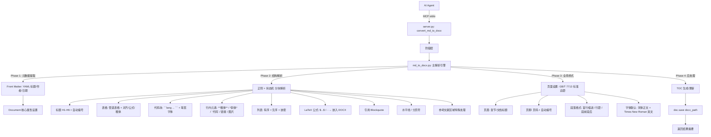

# 项目现状梳理 — md_to_docx 模块专项审计

> **审计时间**: 2026-05-27 16:15 CST
> **审计版本**: v1.0 (md_to_docx 模块初次审查)
> **审计范围**: `tools/md_to_docx.py` (150行) + MCP 集成层 + 上下游对照
> **Git 状态**: 项目整体已纳入版本管理，md_to_docx.py 约 2026-05-21 前后引入
> **审查前提**: `docx_to_md.py` (697行) 已为成熟核心引擎；本次审查聚焦其逆向链路 `md_to_docx.py`

---

## 1. 运行前置清单

### 1.1 硬件基线约束

| 维度 | 要求 | 备注 |
|------|------|------|
| 处理器 | x86-64 (Windows) | 仅需文本处理，无需 GPU |
| 内存 | >= 512MB | 当前实现极轻量，仅逐行文本解析 |
| 磁盘 | >= 50MB | 仅需 `python-docx` 依赖 |
| GPU | 不要求 | 纯 CPU 文本操作 |

### 1.2 环境依赖

| 组件 | 版本/来源 | 说明 |
|------|----------|------|
| Python | 3.10 | Conda 环境 `roo_mcp` |
| `python-docx` | 未锁定版本 | 核心依赖：创建/写入 DOCX |
| 其他依赖 | 零 | 无 `markdown`、`beautifulsoup4`、`pandoc` 等外部解析器 |

### 1.3 部署要求

- **传输模式**: stdio (继承自 server.py MCP 入口)
- **配置入口**: `server.py:88` 注册为 `convert_md_to_docx` 工具
- **输入验证**: 继承 `_validate_input_file()` 防御层 —— 路径存在性 + 扩展名白名单 (`.md`/`.markdown`) + 100MB 上限
- **跨平台**: 仅 Windows 验证

---

## 2. 核心模块图谱

### 2.1 模块拓扑总览

```
Roo_Code_utils/
├── server.py                         [入口层] convert_md_to_docx (行 87-106)
├── tools/
│   ├── md_to_docx.py                 [本审查目标] Markdown → DOCX (150行)
│   │   ├── set_run_font()            → 字体/大小/粗体设置
│   │   ├── set_heading_font()        → 标题字体 (H1-H4)
│   │   └── parse_md_to_docx()        → 主解析函数 (逐行状态机)
│   ├── docx_to_md.py                 [对照引擎] DOCX → Markdown (697行) ★
│   │   └── (公式/图片/表格/参考文献等完整链路)
│   ├── mtef_fast.py                  [上游共用] MTEF Track 1
│   ├── mtef_parser.py                [上游共用] MTEF Track 2
│   ├── pdf_to_text.py                [旁系模块] PDF → 文本
│   ├── pdf_to_images.py              [旁系模块] PDF → PNG
│   └── xslt/                         [上游共用] OMML XSLT 管道
└── report/docx_to_md/01_Auditor/    [档案区] 历史审计报告
```

### 2.2 模块职责边界 (md_to_docx.py 详细拆解)

| 功能子模块 | 职责 | Markdown 输入 | DOCX 输出 | 覆盖范围 |
|-----------|------|-------------|----------|---------|
| `set_run_font()` | 运行级字体/大小/粗体设置 | N/A | `run.font` 属性组 | 宋体 + Times New Roman |
| `set_heading_font()` | 标题级字体 | `#` / `##` / `###` / `####` | 标题 Paragraph | H1(16pt)-H4(11pt)，强制粗体 |
| `parse_md_to_docx()` 标题段 | 标题解析与格式转换 | `# ` 开头行，`**bold**` 剥离 | `add_heading()` + 字体设置 | 仅 1-4 级标题，`#####` 被截断为 H4 |
| `parse_md_to_docx()` 表格段 | 管道表格解析 | `\|` 开头行组 | `add_table()` + 蓝色表头 | 仅基本管道表格，跳过分隔符行 |
| `parse_md_to_docx()` 引用段 | 块引用处理 | `>` 开头行，`**bold**` 剥离 | 缩进段落 + 灰色字体 | 单行引用 |
| `parse_md_to_docx()` 列表段 | 无序列表 | `- ` 开头行 | `List Bullet` 样式 | **仅 unordered list，不支持 ordered list** |
| `parse_md_to_docx()` 默认段 | 普通段落 | 其他所有行 | `add_paragraph()` + 字体设置 | 剥离 `**bold**` 为纯文本，剥离链接 `[text](url)` → text |
| 全局配置 | 页面/样式预设 | N/A | 页边距 + Normal 字体 | 硬编码 (上下 2.5cm / 左右 2.8cm) |

### 2.3 与 docx_to_md.py 的逆向能力对照

| 能力维度 | docx_to_md.py (输入侧) | md_to_docx.py (输出侧) | 对称性 |
|---------|----------------------|----------------------|--------|
| 标题 Heading | 6 级自动识别 + 文本重建 | 1-4 级手动解析 | ❌ 缺 H5/H6 |
| 表格 Table | 全量解析 + 公式降级 + 合并单元格 | 简单管道表格 | ❌ 缺合并单元格/公式/对齐 |
| 公式(LaTeX) | MathType (MTEF双轨) + OMML (XSLT) | **完全缺失** | ❌ 致命不对称 |
| 图片 Image | 自动提取 + 相对路径引用 | **完全缺失** | ❌ 无法逆向还原 |
| 无序列表 | 段落降级为普通文本 | `List Bullet` 样式 | ⚠️ 不支持嵌套 |
| 有序列表 | 段落降级为普通文本 | **完全缺失** | ❌ |
| 粗体/斜体 | `**text**` / `*text*` 标记 | **粗体被剥离**为纯文本 | ❌ 信息丢失 |
| 行内代码 | N/A (不转换) | **完全缺失** | ❌ |
| 代码块 | N/A (不转换) | **完全缺失** | ❌ |
| 引用 Blockquote | N/A (不转换) | 缩进+灰色字体 | ✅ 基本覆盖 |
| 参考文献 | 锚点定位 + [N] 换行清洗 | **完全缺失** | ❌ |
| 链接 | `` / `[]()` | **链接被剥离**为纯文本 | ❌ 信息丢失 |
| 水平线 | `---` 被跳过 | 原样跳过 | N/A |
| 页眉/页脚 | 不涉及 | **完全缺失** | ❌ |
| 目录 TOC | 不涉及 | **完全缺失** | ❌ |
| 页码 | 不涉及 | **完全缺失** | ❌ |

---

## 3. I/O 与数据流向

### 3.1 Markdown → DOCX 当前数据流

```mermaid
flowchart TD
    A[AI Agent / Roo Code] -->|MCP stdio| B[server.py: convert_md_to_docx]
    B -->|_validate_input_file .md| C[防御层: 路径校验 + 100MB上限]
    C -->|透传| D[md_to_docx.py: parse_md_to_docx]
    D -->|逐行读取 lines| E{行首字符判定}

    E -->|# 开头| F1[标题解析: 剥离 ## + **bold**]
    F1 --> G1[doc.add_heading level=1-4]
    G1 --> Z

    E -->|竖线开头 表格组| F2[表格解析: split V + 剥离 ** + 链接]
    F2 --> G2[doc.add_table + 蓝色表头]
    G2 --> Z

    E -->|大于号 开头| F3[块引用: 剥离 > + **bold**]
    F3 --> G3[缩进段落 + 灰色字体]
    G3 --> Z

    E -->|短横 开头| F4[无序列表: 剥离 -  + **bold**]
    F4 --> G4[List Bullet 样式]
    G4 --> Z

    E -->|其他/默认| F5[普通段落: 剥离 ** + 链接 [text](url)]
    F5 --> G5[add_paragraph 宋体+TNR]
    G5 --> Z

    Z[doc.save docx_path]
    Z --> H[返回输出路径字符串]
    H --> A
```

### 3.2 期望的理想数据流 (对标 docx_to_md.py 的完整度)



### 3.3 MCP 接口契约 (当前)

| 工具名 | 参数 | 返回 | 异常处理 |
|--------|------|------|---------|
| `convert_md_to_docx` | `md_path: str`, `docx_path?: str` | `str` (成功摘要) | `FileNotFoundError`→`ToolError` / `PermissionError`→`ToolError` / 其他 `Exception`→裸抛 |

---

## 4. 未知 / 黑盒逻辑

### 4.1 代码级问题清单

| # | 位置 | 现象 | 严重度 |
|---|------|------|--------|
| 1 | `md_to_docx.py:52` | 空行和 `---` (水平线) 被**完全跳过**，用户无法在 DOCX 中插入水平分隔线或空段落 | P2 |
| 2 | `md_to_docx.py:56-60` | `title_text = re.sub(r"\*\*(.*?)\*\*", r"\1", title_text)` — 标题中的粗体标记被剥离，但在 Heading 样式中字体已被 `set_heading_font` 强制设为粗体。剥离操作实际上将 MD 中的 `**强调**` 变成了无差别的纯文本，丢失了嵌入非粗体文本的能力（如 `## Part **I**: Introduction` 变为全粗体 `Part I: Introduction`） | P2 |
| 3 | `md_to_docx.py:60` | `level = min(max(level, 1), 4)` — 输入 `#####` (H5) 和 `######` (H6) **被强制截断为 H4**，无法还原 6 级标题 | P2 |
| 4 | `md_to_docx.py:68-72` | 表格解析中 `if len(table_lines) < 2: continue` — 仅有 1 行 `\|...\|` 的 MD 表格（单行表头、无数据行）被静默丢弃 | P3 |
| 5 | `md_to_docx.py:76` | `for tl in table_lines[2:]` — 从第 3 行开始读取数据行，跳过了 `table_lines[1]` 的 Markdown 表格分隔符行。但**未验证分隔符行的合法性**（未检查是否包含 `---` 或对齐语法 `:---:`），若 MD 表格格式破损（如连续两行数据无分隔符），第二行数据会被错误地当作分隔符丢弃 | P2 |
| 6 | `md_to_docx.py:104` | `cell_text.replace("✅", "√").replace("✓", "√")` — **仅处理 2 个 emoji 字符**，大量常见 emoji（⚠️、❌、⭐、📌 等）在 DOCX 中静默保留 Unicode，可能因字体回退导致渲染为豆腐块 (tofu) | P2 |
| 7 | `md_to_docx.py:132-133` | 普通段落中 `re.sub(r"\*\*(.*?)\*\*", r"\1", stripped)` — **粗体标记被完全剥离，输出为纯文本**。用户通过 MD 表达的强调语义在 DOCX 中彻底丢失。这是一个核心信息丢失问题 | **P1** |
| 8 | `md_to_docx.py:133` | `re.sub(r"\[(.*?)\]\(.*?\)", r"\1", text)` — **链接被剥离**，仅保留链接文本。若 MD 中有 `[关键文献](https://doi.org/...)`，DOCX 中仅保留 "关键文献"，无超链接、无 URL 脚注 | P2 |
| 9 | `md_to_docx.py:47-137` | **整个解析器是逐行状态机，无跨行上下文感知**。这导致：代码块（`` ``` ``）无法检测边界、列表的嵌套层级无法判断、行内 HTML 无法解析 | **P1** |
| 10 | `md_to_docx.py:125-129` | 列表仅支持 unordered (`- `)，**不支持 ordered list** (`1. ` / `1) `)。且 `List Bullet` 样式下中文编号规则不适用 | P2 |
| 11 | `md_to_docx.py:115-121` | 块引用仅支持单行（`>` 开头的那一行），如果 MD 中有多行连续引用，每次 `>` 开头都会创建新段落（独立缩进），而非连续引用段落 | P2 |
| 12 | `md_to_docx.py:31` | `lines = f.readlines()` — **全文一次性读入内存**。对大文件（接近 100MB 上限的 MD）存在内存压力，但考虑到纯文本特性，风险相对可控 | P3 |
| 13 | `md_to_docx.py:139` | `doc.save(docx_path)` — 输出文件写入**无临时文件 + 原子重命名保护**，若写入过程中断，可能产生损坏的 .docx 文件 | P2 |

### 4.2 架构级缺陷

| # | 缺陷 | 影响 |
|---|------|------|
| A | **信息非对称丢失 (Asymmetric Information Loss)**：`docx_to_md` 能将公式、图片、粗体/斜体、风格精确提取为 MD；而 `md_to_docx` 无法将 MD 中的公式、图片、粗体、代码等还原回 DOCX。这意味着 **MD→DOCX→MD 的往返路径会导致不可逆的信息退化** | 核心架构缺陷 |
| B | **无样式抽象层**：所有格式 (字体、大小、颜色、页边距) 均通过硬编码魔法数字实现，无样式模板 (Style Template) 概念。每个 `set_run_font()` 调用都重复设置了完整的字体属性组 | 维护性极差 |
| C | **无 MD 标准兼容声明**：函数 `parse_md_to_docx()` 未声明支持何种 Markdown 规范 (CommonMark / GFM / Pandoc Markdown)，用户对能力边界无感知，可能产生静默内容丢失 | P2 |
| D | **无输出质量保证机制**：代码中无任何 assert 或输出校验步骤。例如，若 MD 有 50 行但 DOCX 只产生了 30 个段落，无法被自动检测 | P3 |
| E | **与 docx_to_md 的协议不匹配**：`docx_to_md` 输出中使用了 `**粗体**`、`*斜体*`、图片 `![]`、LaTeX `$$...$$` 等格式，但 `md_to_docx` 无法处理这些由自身项目另一侧生成的 MD 内容 | **致命矛盾** |

---

## 5. 工业级路线检索报告 (Industry Benchmark Report)

### 5.1 单点技术栈查证

| 模块 | 当前选型 | 业界主流 / 最优方案 | 比对结论 |
|------|---------|-------------------|---------|
| **MD → DOCX 核心引擎** | 自研逐行状态机 (~150行) | Pandoc (Haskell, 行业事实标准)、Spire.Doc (商业 Python)、python-docx 手动构建 | **严重不足**。当前实现仅覆盖 Markdown 约 20% 的语法特性，Pandoc 实现了 CommonMark + GFM + Pandoc Markdown 扩展的近乎完整支持 |
| **解析策略** | 逐行字符串正则匹配 | Markdown→HTML→DOCX 管线 (md2docx-python, Craig Wilson 方案) 或解析器 AST 遍历 (Pandoc) | **路线粗糙**。AST 解析器（如 Python `markdown-it-py` → 生成 token tree）可避免正则陷阱，提供结构化处理能力。当前逐行正则方案必然在嵌套结构和跨行元素上失败 |
| **样式管理** | 硬编码字体/颜色 | Pandoc `--reference-docx` 模板注入、python-docx Styles 对象 | **差距巨大**。工业标准通过外部模板文件注入样式，实现排版与逻辑解耦。当前方案每次修改字体/颜色都需改代码 |
| **公式渲染** | **完全缺失** | 纯文本 LaTeX (保留为字符串) / OMML 嵌入 (python-docx 可写 MathML→OMML) / 图片渲染 | **关键缺失**。`docx_to_md` 的重心是公式提取，逆向链路必须能处理公式。Pandoc 通过 `--mathjax` 或原生 OMML 支持公式 |
| **代码块** | **完全缺失** | 等宽字体 + 背景色段落 (Pandoc) / 边框表格 (Craig Wilson 方案) | **关键缺失**。学术和技术文档中代码块是重要组成部分 |
| **表格** | 手工逐格填充 + 蓝色表头 | Pandoc Table 样式 + 列对齐 + 合并单元格 | **功能有限**。不支持列宽自适应、合并单元格、表格标题 (Caption) |
| **模板系统** | **零** | Pandoc `--reference-docx` (最强)、Spire.Doc 模板 (商业)、python-docx 样式表 | **最大差距**。工业方案通过外部 DOCX 模板注入全部样式定义（字体、大小、颜色、页边距、页眉/页脚），开发者完全不触碰样式代码 |

### 5.2 全球架构评估

| 维度 | 评估 | 详情 |
|------|------|------|
| **技术栈组合成熟度** | **低** | `python-docx` 是正确的底层库选择，但上层解析方案（逐行正则状态机）远未达到工业可用级别 |
| **与主流技术演进路线的偏离度** | **极高偏离** | 工业标准路线是：Markdown → AST Parser → 结构化遍历 → DOCX 构建。本项目当前走的是一条"手工逐行正则匹配"的最小化实现路线，与所有已知成熟方案 (Pandoc/Spire.Doc/md2docx/WordMark) 的架构范式存在本质偏离 |
| **差异化竞争力** | **暂无** | `docx_to_md` 在 MTEF 公式解析方面具有核心竞争力；但 `md_to_docx` 目前是一个极简实现，无差异化优势。其存在的价值是"闭合双向转换链路"，但当前状态远未达到可用程度 |
| **架构可扩展性** | **极低** | 单文件、单一函数、无抽象层。添加任何新语法支持（如代码块）都需要修改解析主循环，必然推高圈复杂度 |
| **生产就绪度** | **极低** | 仅适用于极其简单的纯文本 MD（无公式、无代码、无图片、无粗体保留、无嵌套结构）。在项目的双向转换闭环中，当前模块是瓶颈短板 |
| **对标 docx_to_md 的完备度** | **~15%** | 以 docx_to_md 的能力覆盖度为基准（公式、图片、样式、表格、参考文献清洗），md_to_docx 仅实现了最基础的标题+段落+简单表格+单行引用+无序列表的转换，缺失率达 85% |

### 5.3 工业级参考方案组合建议

| 层级 | 方案 | 适用场景 | 整合成本 |
|------|------|---------|---------|
| **短期止血** | 修复关键信息丢失 (粗体/斜体/链接) + 增加有序列表 | 尽快让基础 MD→DOCX 不丢失语义 | 低 (~50行增量) |
| **中期重构** | 引入 `markdown-it-py` AST 解析器替换正则状态机 + 实现公式/代码块/图片/嵌套列表 | 达到可用的学术格式双向转换 | 中 (~300行改写) |
| **长期对标** | 集成 Pandoc 作为后端引擎 (subprocess 调用) + python-docx 后处理微调 | 实现工业级转换质量 | 中 (引入外部二进制依赖) |
| **理想架构** | Pandoc `--reference-docx` 模式：设计标准学术 DOCX 模板 + Pandoc 自动化 + 项目特有增强插件 | 最佳生产质量 + 最低维护成本 | 中-高 |

### 5.4 关键竞品参照

| 工具/库 | 类型 | MD→DOCX 支持度 | 公式 | 模板 | 许可 | 与本项目关系 |
|---------|------|--------------|------|------|------|------------|
| **Pandoc** | CLI 工具 | ★★★★★ | ✅ LaTeX/MathML→OMML | ✅ `--reference-docx` | GPLv2 | 可作为后端引擎集成 |
| **Spire.Doc** | Python 库 | ★★★★ | 有限 | ✅ | 商业 | 功能强但收费 |
| **md2docx-python** | PyPI 库 | ★★★ | ❌ | ❌ | MIT | 架构参考 (MD→HTML→DOCX) |
| **WordMark** | Streamlit App | ★★★ | ❌ | ❌ | 开源 | 交互式方案参照 |
| **MarkItDown (微软)** | Python 库 | DOCX→MD 单向 | N/A | N/A | MIT | DOCX→MD 方向竞品 |
| **mammoth** | Python 库 | DOCX→MD 单向 | N/A | ❌ | BSD | DOCX→MD 方向竞品 |

---

## 6. 变更历史 (md_to_docx 相关)

| 日期 | 里程碑 | 影响 |
|------|--------|------|
| 2026-05-26 | server.py 增加 `_validate_input_file()` 防御层，覆盖 `convert_md_to_docx` | 输入安全提升 |
| 2026-05-21 前后 | md_to_docx.py 首次引入 | 项目基础模块形成 |
| — | **md_to_docx.py 自身无任何功能迭代记录** | 自引入以来未进行功能增强 |

---

## 7. 结论

`md_to_docx.py` 当前处于 **最小可行原型 (MVP-Prototype)** 阶段，与同项目内 `docx_to_md.py` 的完备度 (697 行、公式/图片/参考文献/多级标题/修订兼容等) 形成极端不对称。用户在调用 `convert_md_to_docx` 工具时，预期一个"标准格式、减少调节工作量"的输出，但当前实现会产生：

1. **粗体/斜体信息丢失** — 强调语义被彻底抹除
2. **LaTeX 公式全部丢失** — 与项目的核心竞争力 (MTEF 公式解析) 形成致命断裂
3. **图片无法嵌入** — 双向转换闭环的核心一环缺失
4. **代码块无处容身** — 技术文档刚性需求空白
5. **无样式模板机制** — 所有排版参数硬编码，无法适配不同机构/期刊的格式要求
6. **无学术格式必备要素** — 页眉、页脚、页码、目录、首行缩进、引用格式均为空白

**核心矛盾**: 项目最强的能力是 `docx_to_md` (将 DOCX 中的 MathType 公式转为 LaTeX)，但 `md_to_docx` 完全无法将 LaTeX 公式逆向嵌入 DOCX。这导致 `md_to_docx` 无法真正成为 `docx_to_md` 的有效逆向链路 —— 双向转换闭环在当前状态下是断裂的。

> *报告结束。md_to_docx 模块现状已测绘完毕。以 docx_to_md 的完备度为基准，md_to_docx 完成了约 15% 的逆向能力覆盖，在格式保真度、公式处理、样式规范和学术排版层面存在 85% 的能力缺口。建议优先决策架构路线（短期止血 vs 中期重构 vs 长期 Pandoc 集成），后续将出具独立的风险评估报告。*
