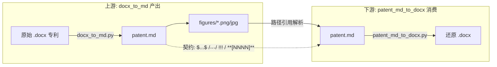
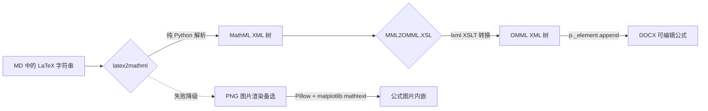

# 项目现状梳理 — patent_md_to_docx 专利 Markdown 逆向还原引擎

> **审计时间**: 2026-05-31 11:08 CST
> **审计版本**: v1.0 (项目立项前审查 — 零代码阶段)
> **项目根路径**: `D:/FJL/Projects/Kilo_Code_Gobal_Settings/Roo_Code_utils/`
> **目标路径**: `report/patent_md_to_docx/`
> **上游依赖项目**: `docx_to_md` (已完工)、`md_to_docx` (已完工但功能受限)

---

## 1. 运行前置清单

### 1.1 硬件基线约束

| 维度 | 要求 | 备注 |
|------|------|------|
| 处理器 | x86-64 (Windows) | 与现有 Roo_Code_utils 基础环境一致 |
| 内存 | >= 4GB (建议 8GB+) | 大体积专利文档含大量公式/图片时需额外内存 |
| 磁盘 | >= 200MB 额外可用空间 | 含新增 Python 依赖 + 输出 DOCX |
| GPU | 不要求 | 公式走纯 CPU 文本转换管线 (LaTeX → MathML → OMML) |

### 1.2 环境依赖 (预估)

| 组件 | 版本 | 用途 |
|------|------|------|
| Python | 3.10 (现有 `roo_mcp` 环境) | 运行基础 |
| `python-docx` | 现有依赖 | DOCX 文件生成与 OMML 节点注入 |
| `lxml` | 现有依赖 | XML/HTML 解析 + XSLT 转换 |
| `Pillow` | 现有依赖 | 图片尺寸检测与嵌入前的预处理 |
| `latex2mathml` | **新增** — PyPI `latex2mathml` | LaTeX 公式 → MathML 中间表示 |
| `MML2OMML.XSL` | **外部资源** — Microsoft Office 附带 | MathML → OMML 转换样式表 |
| `olefile` | 现有依赖 | 不直接使用，但为未来 MathType OLE 反向写入预留 |

### 1.3 部署要求

- **集成方式**: 作为新 MCP 工具 (`patent_md_to_docx`) 注册到 `server.py`，或独立为 `tools/patent_md_to_docx.py`
- **传输模式**: stdio (继承现有 FastMCP 架构)
- **输入文件**: 由 `docx_to_md.py` 产出的专利 Markdown 文件（含 LaTeX 公式、图片相对路径引用、`[NNNN]` 段落编号）
- **预期输出**: 还原为符合中国专利局 (CNIPA) 格式规范的 `.docx` 文件，公式为可编辑 OMML，图片内嵌

---

## 2. 核心模块图谱

### 2.1 当前代码库中与 patent_md_to_docx 直接关联的模块

```
Roo_Code_utils/
├── server.py                         [入口层] —— 需新增 patent_md_to_docx MCP tool 注册
├── tools/
│   ├── docx_to_md.py                 [上游源] 产出专利 MD 的引擎 (697 行)
│   │   ├── 公式输出: $...$ / $$...$$ (LaTeX 内联/块级)
│   │   ├── 图片输出:  (相对路径)
│   │   ├── 段落输出: [0001] [0002] 编号段落
│   │   └── 粗体: **text** / 斜体: *text*
│   ├── md_to_docx.py                 [现有基座] 通用 MD → DOCX (150 行，功能不完整)
│   │   ├── ✅ 标题 # → Heading (H1-H4)
│   │   ├── ✅ 表格 |...| → docx Table
│   │   ├── ✅ 引用 > → Blockquote
│   │   ├── ✅ 列表 - → List Bullet
│   │   ├── ✅ 中文字体 (宋体) / 英文 (Times New Roman)
│   │   ├── ❌ 公式 LaTeX → OMML (完全缺失)
│   │   ├── ❌ 图片引用  → 内嵌图片 (完全缺失)
│   │   ├── ❌ 粗体/斜体保留 (当前被 stripping)
│   │   └── ❌ 段落编号 [NNNN] (未识别)
│   ├── mtef_fast.py                  [不直接使用] MTEF Track 1
│   ├── mtef_parser.py                [不直接使用] MTEF Track 2
│   └── xslt/
│       ├── omml2mml.xsl              [方向相反] OMML → MathML (现有 docx_to_md 使用)
│       └── mmltex.xsl                [方向相反] MathML → LaTeX
│
│   缺失资源 (需新建或引入):
│   └── MML2OMML.XSL                  [关键依赖] MathML → OMML (需从 MS Office 提取)
├── raw/                              专利 DOCX 源文件存放区
├── raw_md/                           专利 MD (docx_to_md 输出) 存放区
└── report/
    └── patent_md_to_docx/            本项目审计档案
```

### 2.2 目标模块职责边界 (设计态)

| 模块 | 职责 | 输入 | 输出 | 新增依赖 |
|------|------|------|------|---------|
| `patent_md_to_docx.py` (待建) | 专利 MD→DOCX 全流程编排 — 分段解析、公式转换、图片嵌入、样式还原 | 专利 `.md` 路径 | `.docx` 文件 (CNIPA 兼容) | `latex2mathml`, `MML2OMML.XSL`, `python-docx`, `lxml` |
| `formula_converter.py` (待建/内联) | LaTeX → MathML → OMML 双跳管道 | LaTeX 字符串 (`$...$` 内容) | `<m:oMath>` OMML XML 节点 | `latex2mathml`, `lxml.XSLT`, `MML2OMML.XSL` |
| `image_embedder.py` (待建/内联) | 从 MD 相对路径读取图片并内嵌到 DOCX paragraph | 图片路径 `str` | `python-docx` InlineShape/Image | `Pillow` (尺寸检测) |
| `server.py` (修改) | 新增 `patent_md_to_docx` MCP tool 注册 + 输入防御 | MCP stdio 请求 | MCP stdio 响应 | 无 |

---

## 3. I/O 与数据流向

### 3.1 目标逆向链路 (patent_md_to_docx Data Flow)

```mermaid
flowchart TD
    A[AI Agent / Roo Code] -->|MCP stdio| B[server.py FastMCP]
    B -->|patent_md_to_docx md_path| C[patent_md_to_docx.py 主入口]
    
    C -->|文件读取| D[专利 MD 文本]
    D --> E{逐行/逐段解析}
    
    E -->|# 开头| F1[Heading 标题段]
    E -->|粗体斜体| F2[Run 级样式]
    E -->|正则匹配| F3{内容类型判定}
    
    F3 -->|匹配 $...$| G1[Inline LaTeX 公式]
    F3 -->|匹配 $$...$$| G2[Display LaTeX 公式]
    F3 -->|匹配 standalone 公式行| G3[独立块公式]
    F3 -->|匹配 !!]| G4[图片引用]
    F3 -->|匹配 [NNNN]| G5[段落编号]
    F3 -->|普通文本| G6[Paragraph 正文]
    
    G1 --> H1[LaTeX → MathML latex2mathml]
    G2 --> H1
    G3 --> H1
    H1 --> H2[MathML → OMML MML2OMML.XSL]
    H2 --> H3[m:oMath OMML 节点]
    H3 --> H4[注入 python-docx paragraph._element]
    
    G4 --> I1[resolve 图片路径]
    I1 --> I2[python-docx add_picture inline]
    
    G5 --> J1[python-docx add_paragraph 编号前缀]
    G6 --> J1
    
    F1 --> K1[python-docx add_heading]
    F2 --> K2[Run.bold / Run.italic 设置]
    
    H4 --> L[最终 DOCX 文件]
    I2 --> L
    J1 --> L
    K1 --> L
    K2 --> L
```

### 3.2 与上游 docx_to_md 的契约关系



### 3.3 公式转换的三级管线



> **关键设计决策**: 公式三级管线 — Tier 1: latex2mathml → MML2OMML (原生 OMML)，Tier 2: 纯文本降级 (丢失编辑能力)，Tier 3: PNG 图片备选 (视觉保真但不可编辑)。工业对标 MarkView 的三层体系 (OMML / PNG / Text)。

---

## 4. 接口契约（设计态）

| 工具名 | 参数 | 返回 | 异常处理 |
|--------|------|------|---------|
| `patent_md_to_docx` | `md_path: str`, `docx_path?: str`, `formula_mode?: Literal["omml","text","png"]` | `str` (成功路径+统计摘要) | 分级异常: FileNotFoundError / FormulaConversionError / ImageEmbedError |

**MCP Tool 注册 (server.py 拟新增)**:
```python
@mcp.tool()
def patent_md_to_docx(md_path: str, docx_path: str = None,
                       formula_mode: str = "omml") -> str:
    """将专利 Markdown (含 LaTeX 公式) 逆向还原为 DOCX，公式转为可编辑 OMML。"""
    _validate_input_file(md_path, "patent_md_to_docx")
    ...
```

---

## 5. 核心实现挑战与黑盒逻辑

### 5.1 尚未闭源的技术决策点

| 决策项 | 候选方案 | 不确定性 | 审计评级 |
|--------|---------|---------|---------|
| **LaTeX → OMML** | A. `latex2mathml` + `MML2OMML.XSL` (XSLT 管道) | MML2OMML.XSL 是否为自由再分发文件？是否在所有 MS Office 版本中一致可用？双跳管道的公式保真度覆盖多少 LaTeX 命令？ | ⚠️ 需验证 |
| **LaTeX → OMML (备选)** | B. `pandoc` 子进程调用 (`pandoc -f latex -t docx`) | 引入 Haskell 子进程依赖，破坏纯 Python 架构原则；Pandoc 生成的 OMML 兼容性因版本而异 | ⚠️ 架构污染 |
| **LaTeX → OMML (备选)** | C. `Spire.Doc` 商业库 | 商业授权成本 ($599+)、闭源二进制依赖 | ❌ 不推荐 |
| **图片路径解析** | 相对路径 `figures/xxx.png` → 绝对路径解析基准 | MD 文件被移动到其他目录时路径断裂；`image_map` 映射表不在 MD 中持久化 | ⚠️ 需定约 |
| **段落编号 `[NNNN]`** | 正则提取 → `p.add_run("[0001] ")` 前置编号 | 编号格式是否与原始 DOCX 完全一致？是否需要 paragraph numbering 样式而非文本前缀？ | ⚠️ 需验证 |
| **代码复用策略** | 是改造现有 `md_to_docx.py` (追加) 还是新建 `patent_md_to_docx.py` (独立) | 两文件共享大量基础逻辑 (Heading/Table/Paragraph/Style)，但专利转化有大量特化需求 | ⚠️ 架构决策 |

### 5.2 上游产出物中的未知/不稳定特征

| 位置 | 现象 | 审计评级 |
|------|------|---------|
| MD 公式渲染 | 转换后的 MD 中公式以 `$_{\Theta_{\xi}},\Theta$` 等 LaTeX 片段呈现，存在编码漂移: `$\Theta$` 应为 `\Theta` (大写)，但部分字符被错误转义为数学下标 | **上游数据质量问题** — 逆向时需做 LaTeX 语法容错 |
| MD 图片路径 | 路径格式为 ``，其中 `rId8` 来自 DOCX 内部关系 ID，非人类可读 | **路径脆弱性** — 路径中含空格/中文时需要 URL 编码或不编码的决策一致性 |
| 公式判定标记 | 被解析的 MTEF 公式以 `[MTEF_BLOCK:rIdXX]` 或 `[MTEF_INLINE:rIdXX]` 占位符存在于 MD 中，最终被替换为 `$$...$$`/`$...$` | **可逆性**: 块级/行内判定信息在替换后丢失，仅剩 `$$` vs `$` 区分 |

### 5.3 已知的现有代码缺陷（继承自 docx_to_md.py）

| 位置 | 缺陷 | 对 patent_md_to_docx 的影响 |
|------|------|---------------------------|
| `docx_to_md.py:183-189` | 图片被重复写入两次 (码重复) | **无直接影响** — 但表明上游引擎未经充分代码审查 |
| `docx_to_md.py:439-479` | AlternateContent 处理回调中存在 `OCR_INLINE`/`OCR_BLOCK` 标签 (OCR 已移除) | **逻辑不一致** — OCR 死标签可能被下游解释器误消费 |
| `md_to_docx.py:133` | `**bold**` 和 `[text](url)` 被正则 stripped 而非转换为样式 | **功能缺失** — 逆向时无法从 MD 恢复粗体和超链接 |

---

## 6. 工业级路线检索报告 (Industry Benchmark Report)

### 6.1 单点技术栈查证

| 模块 | 当前/候选选型 | 业界主流 / 最优方案 | 比对结论 |
|------|-------------|-------------------|---------|
| **MD → DOCX 核心引擎** | python-docx + 自定义逐行解析 | Pandoc (Haskell CLI)、markdown2 + python-docx、docx-template (Jinja2) | **Pandoc 是大而全方案但引入非 Python 依赖**；python-docx 自定义解析是 Python 生态中最可控的路线。已有 `md_to_docx.py` 可通过扩展而非重写实现。 |
| **LaTeX → OMML 公式** | `latex2mathml` + `MML2OMML.XSL` (双跳 XSLT) | Pandoc (内置 OMML writer)、MathType SDK (COM, Windows-only)、texmath (Haskell)、Ecuaciones a Word (SaaS) | **核心风险点**: `MML2OMML.XSL` 来自 MS Office 安装目录 (`C:\Program Files\Microsoft Office\root\Office16\MML2OMML.XSL`)，**不是自由可再分发文件**。这意味着: (a) 用户需要已安装 MS Office；(b) 不应直接将 XSL 纳入 Git 仓库。备选: 使用 `python-docx` 的 `OxmlElement` 手动构建 OMML 节点树 (高工作量但零外部依赖)。 |
| **LaTeX → MathML** | `latex2mathml` (PyPI, 纯 Python) | KaTeX (Node.js)、MathJax (Node.js)、SnuggleTeX (Java)、texmath (Haskell) | `latex2mathml` 是**纯 Python 生态中唯一成熟的方案** (GitHub 200+ stars, 27 releases)。覆盖 80%+ 常用 LaTeX 命令，但复杂矩阵、对齐环境 (`\begin{aligned}`) 可能失败并降级。 |
| **DOCX 图片嵌入** | python-docx `add_picture()` | python-docx、Spire.Doc (商业) | python-docx 原生支持图片嵌入，无需额外依赖。 |
| **中文专利排版** | python-docx 手动设置 `rFonts` + `eastAsia` | 无专用开源方案 | CNIPA 自 2025 年要求 XML 格式电子申请（非 DOCX），但 DOCX 仍为事务所内部流转的主要格式。排版规范无严格自动化校验标准。 |

### 6.2 LaTeX → OMML: 开源生态竞争格局

| 方案 | 路线 | 优势 | 劣势 | 推荐度 |
|------|------|------|------|--------|
| **A** `latex2mathml` + `MML2OMML.XSL` | 纯 Python 文本 → XSLT | 零网络依赖、可离线、Python 原生集成 | MML2OMML.XSL 许可风险、双跳管道可能引入数学校验错误 | ⭐⭐⭐ (首选但需解决许可) |
| **B** Pandoc 子进程 | 外部 CLI | 覆盖最广的 LaTeX 命令、社区强大 | 引入 Haskell 依赖 (~200MB)、子进程调用开销、非原子操作 | ⭐⭐ |
| **C** MathType COM API | Windows COM 自动化 | MathType 官方支持、最高保真度 | 仅 Windows、需 MathType 许可证、COM 不稳定 | ⭐ (高风险) |
| **D** 手动构建 OMML | 纯 python-docx OxmlElement | 零外部依赖、完全可控、许可清洁 | 开发工作量大、需深入理解 OMML 规范、维护成本高 | ⭐⭐⭐ (中长期最优) |

### 6.3 全局架构评估

| 维度 | 评估 | 详情 |
|------|------|------|
| **技术栈组合成熟度** | **中** | `python-docx + latex2mathml + lxml/XSLT` 是可工作的组合，但 `MML2OMML.XSL` 的许可与分发存在不确定性，增加了部署门槛 |
| **与现有项目架构的契合度** | **高** | 完全遵循现有 MCP 工具模式 (FastMCP + python-docx + lxml)，可与 `docx_to_md.py` 形成对称的"正反向转换"工具体系 |
| **专利格式还原度** | **中 (可达成)** | CNIPA 专利文档的核心格式要素 (四号宋体正文、段落编号、标题层级、公式、图片) 均可在 python-docx 中实现，但"与原始 DOCX 逐像素一致"是不可达目标 (DOCX → MD 是损失性转换) |
| **与主流技术演进路线的偏离度** | **无偏离** | "文档处理工具通过 MCP 协议暴露给 AI Agent"是本项目的核心理念，"AI Agent 读取 MD → 修改内容 → 还原 DOCX"是闭环工作流的必然需求 |

---

## 7. 变更历史概要 (本项目)

| 日期 | 里程碑 | 影响 |
|------|--------|------|
| 2026-05-31 | patent_md_to_docx 项目立项审查 (本次审计) | 需求定义、技术路线评估、风险识别 |
| 待定 | 技术方案选择决策 (方案 A/B/C/D) | 决定核心公式转换路线的最终实现 |
| 待定 | 第一版实现 (`tools/patent_md_to_docx.py`) | 最小可用原型 |

---

## 8. 开发建议路线图

### Phase 1: 基础框架 (复用扩展现有 `md_to_docx.py`)

1. 保留现有 Heading / Table / Paragraph 解析
2. 新增 `**bold**` → `Run.bold` + `*italic*` → `Run.italic` 的样式保留
3. 新增 `` → `add_picture()` 图片嵌入
4. 新增 `[NNNN]` 段落编号识别与保留

### Phase 2: 公式转换核心

1. 实现 LaTeX 解析器 (识别 `$...$` / `$$...$$` / 独立公式行)
2. 集成 `latex2mathml` → `MML2OMML.XSL` 管道
3. 实现 Tier 1/2/3 降级策略

### Phase 3: 专利特定格式化

1. 中文宋体/英文 Times New Roman 自动混排
2. 页边距、行距 (符合事务所标准)
3. 标题段号自动编号

### Phase 4: MCP 集成与测试

1. `server.py` 新增 MCP tool 注册
2. 输入防御 (路径验证、文件类型检查)
3. 回归测试: 使用 `raw/` 目录下的专利文件做完整闭环测试 (DOCX → MD → DOCX → MD，比对两次 MD 的差异)

---

> *报告结束。本项目处于**零代码设计阶段**，核心技术路线已明确但存在一个关键的许可合规风险 (MML2OMML.XSL)。建议在 Phase 2 实施前完成方案 A 的许可评估，或决定转向方案 D (手动构建 OMML)。详见随附的《风险评估》报告。*
